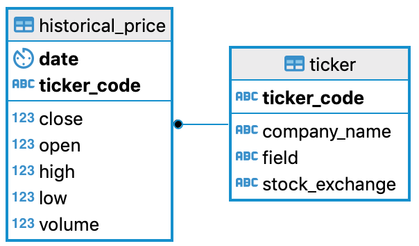

# Vandl (Vietnam stock Data Bundle)

This project aims at collecting stock data of the Vietnamese market for the research purpose. Thanks for the generosity of the VNDIRECT company to share their data via the website https://www.vndirect.com.vn/ that I can complete this fun and simple program.

## Motivation

The economy of Vietnam is booming; therefore, sooner or later, the stock trading will be automated as a natural development trend of technology. However, currently, there is a minimal source of data available for users to tinker with. There are just a few data vendors are charging a fee for the Vietnam stock data.
As motivated by that, I started this project to practice the data engineering skill and, more importantly, is owning an available and free database to conduct trading strategy research. Besides that, I also hope that this simple program can help anyone interested in the domestic stock market and data science.

## Features

### Database Setup
This module helps users to quickly set up the data tables in Postgresql, with the automatic data downloading capability from the frequently updated data source in my Google Drive.

### Google Drive Operator
This module utilizes the Google Drive API library to download and update the content of files in the free cloud solution.
More details of setting up authentication for this API can be found in this [documentation.](https://developers.google.com/drive/api/v3/quickstart/python/)
* Download Operator: it does not require the user to enable Google Drive API. Currently, it links directly to files that I store using my own drive. Users can change the IDs of the files to their personal storage by getting the shareable link of the files. For example, if the link is https://drive.google.com/file/d/1rhM3tn39cq9e0K-x8jCw-xXaFCGFHu73/view?usp=sharing then ID of this file is 1rhM3tn39cq9e0K-x8jCw-xXaFCGFHu73
* Upload Operator: it requires the user to enable Google Drive API and download the credentials as credentials.json file.

### Proxy Operator
This module helps the main program to bypass the anti-bot mechanisms of some websites. However, in this case of VNDIRECT, it seems that they do not implement such kind of tools.
The VPN service provider in this project is NordVPN, so the user needs to have an account with them to use the proxy operator.

### ETL Engine
This module is the heart of the project; it controls the web via Selenium in two mechanisms, 1- download CSV files and 2- scraping via HTML. To improve the ingestion speed, the multithreading is applied. However, be careful with the number of threads setting as it could potentially jam the machine.
The data model is straightforward, as below.


## How to start

### Important Forewords
This program was developed on the Ubuntu environment; therefore, users on other OS should be aware of the difference of syntax to terminate processes. Please change it according to your situation.

### Practicum
* Run setup_database.py, the program will ask for a sudo password via the library getpass; this password is not stored physically; hence, please not be worry about it.
* Run etl_vndirect.py with the following arguments.

    ```python
    - mode:
    * use first_load when the whole database needs to be reloaded from beginning
    * the program will download CSV files from the data vendor to ensure the best quality

    * use incremental_load during regular operation
    * the program will ingest information from html to increase loading speed

    - inactive_days: this sets the limit of inactive days for a stock to be 
    * considered as a dead one

    - threads: this sets the number of concurrent threads to ingest data
    ```
* Run the following query to validate the ingested data.

    ```sql
    select ticker_code, max(date), min(date) from "historical_price" 
    group by ticker_code
    having max(date) > (CURRENT_DATE + INTERVAL '-1 year')
    order by min(date) desc;
    ```

## Improvement in Progress
* The dependency on one singular data vendor is a risk that this project is taking. Therefore, I am transforming the ETL engine to be more robust and can handle the data ingestion from different vendors.
* The trash processes cleaning method currently is brutal, and it terminates all other Chrome and Python processes. This will be improved by keeping a record of what processes this program started.